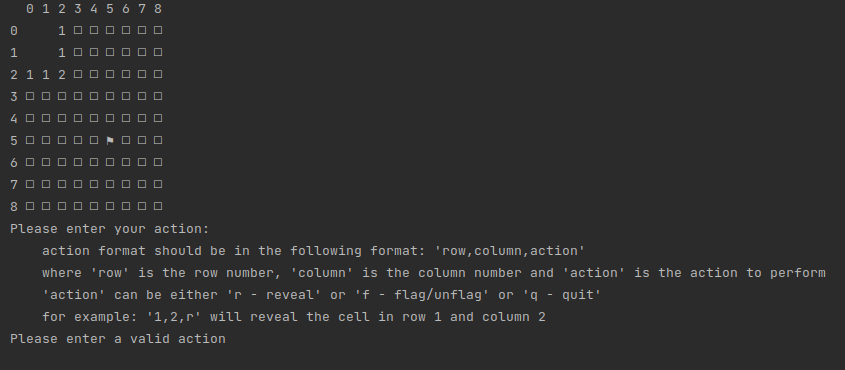
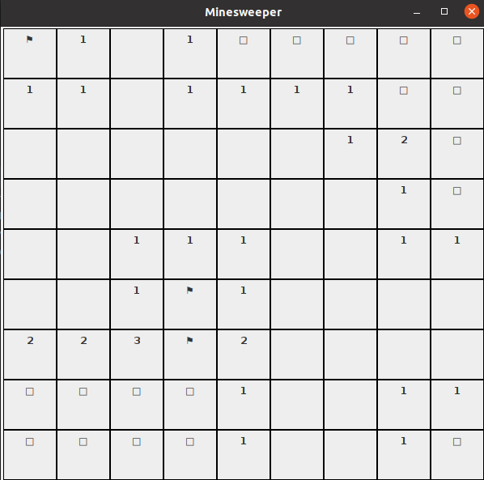

# Minesweeper Game
This is a Minesweeper game developed in Java 11 using Swing 19. The game can be played in two modes: console and GUI.

# Prerequisites
- Java 11 or higher
- Apache Maven 3.8.6 or higher

# Installation
- Pull the application on you local invironment
- Run `mvn clean install`
- Find `minesweeper-game.jar` in `<project-path>/minesweeper-game/target` folder

# Predefined Game Boards
The game includes three predefined game boards: Beginner, Intermediate, and Expert. These game boards have different sizes and numbers of mines, as follows:

- Beginner: 8x8 grid with 10 mines
- Intermediate: 16x16 grid with 40 mines
- Expert: 16x30 grid with 99 mines

To select a predefined game board, simply choose the corresponding option from the menu in GUI mode, or specify the board size and number of mines in console mode.

# Console Mode
In console mode, the game is played entirely in the console. The player is presented with a grid of hidden squares, some of which contain mines. The player must uncover squares to reveal what is underneath them. If the player uncovers a mine, the game is over. The goal is to uncover all squares that do not contain mines.

To play the game in console mode, run the following command:
`java -jar minesweeper-game.jar console`

# GUI Mode
In GUI mode, the game is played using a graphical user interface. The player can click on squares to uncover them, and right-click to flag squares that they believe contain mines. The player can also click on the smiley face icon to restart the game at any time.

To play the game in GUI mode, run the following command:
`java -jar minesweeper-game.jar gui`

# License
This Minesweeper game is licensed under the MIT License. See the LICENSE file for more information.

# Credits
This game was developed by Andrii Chehrynets

# TODO
- Add score result
- Add ability to save game board and continue later
- Better user experience for GUI
